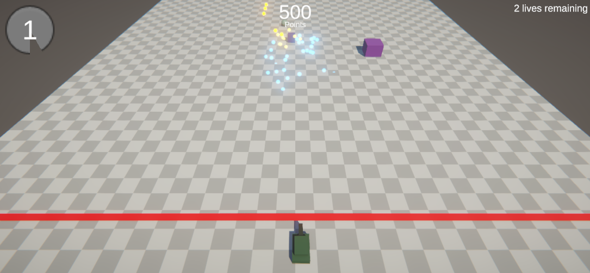

# Tank Shooter
Demo Unity game

## Controls

* A,D - Move left-right
* Space - Shoot
* Y - Shoot special bullet

## Enemy types

* Small cube - regenerates 10% of enemy cube health on passing the red line
* Big cube - regenerates completely health of all enemies under 50% health when killed
* Small sphere - adds 10% speed to all small spheres when damaged
* Big sphere - reduces speed of all spheres by 10% when damaged